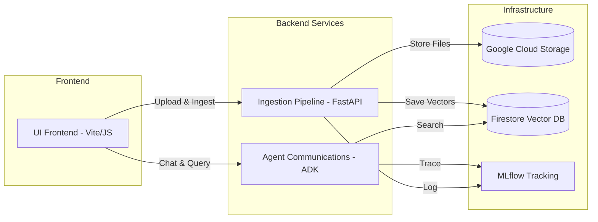
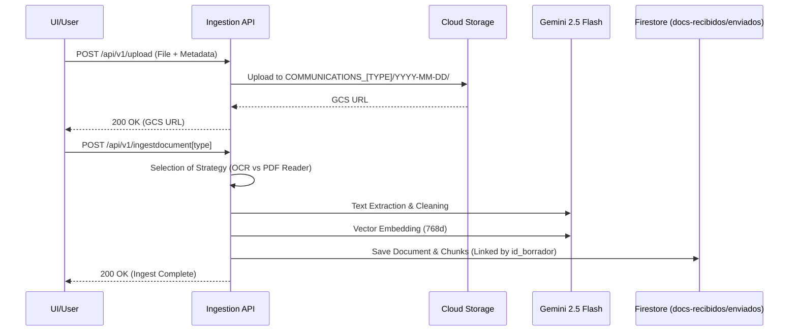
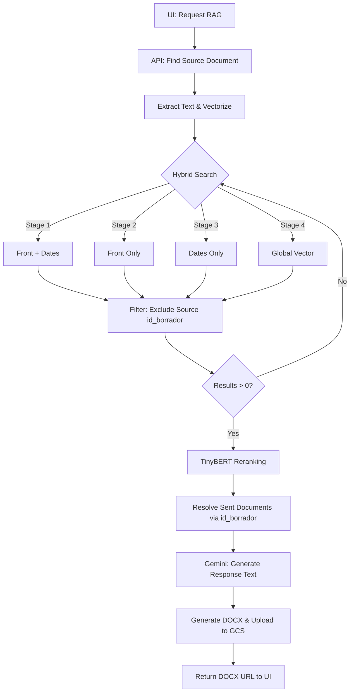

# AI RAG Communications — Engineering Ingestion System

An AI-powered Retrieval-Augmented Generation (RAG) system for processing and querying technical engineering communications. It leverages Clean Architecture, the Pipe & Filter pattern, and the Google Gemini API to extract, embed, and store documents in a Firestore vector database.

---

## 🏗 System Architecture

The system is composed of four independent services that work together:

---

## 🚀 Key Processes

### 1. Document Ingestion (Received & Sent)
The system differentiates between scanned received documents (OCR needed) and native digital sent documents (PDF Reader).

### 2. RAG Retrieval & DOCX Generation
Retrieves similar historical context to generate a draft response.

---

## 🆔 Document Identification & Linking

| Identifier | Purpose | Firestore Field |
|---|---|---|
| **Draft ID** | Technical link between Received and Sent pairs. | `id_borrador` |
| **Official Code** | User-facing identifier (e.g. REC-001). | `nombre_objeto` |
| **Filename** | Physical file name in storage. | `nombre_archivo` |

- **RAG Exclusion:** When generating a response for `ID: 1111`, the system retrieves chunks from **other** documents, strictly excluding chunks where `id_borrador == 1111`.
- **Response Resolution:** For every similar chunk found, the system queries the `docs-enviados` collection by `id_borrador` to find the actual historical response.

---

## 🛠 API Reference (Core Endpoints)

### Ingestion Pipeline (:8080)

| Endpoint | Method | Description |
|---|---|---|
| `/api/v1/upload` | `POST` | Uploads file to date-partitioned GCS folder. Returns `gcs_url`. |
| `/api/v1/ingestdocumentreceived` | `POST` | Ingests a received doc. Uses Gemini OCR. |
| `/api/v1/ingestdocumentsent` | `POST` | Ingests a sent doc. Uses PDF Reader. |
| `/api/v1/ingest/batch` | `POST` | Ingests from `Comunicaciones.csv`. Supports `?limit=N`. |
| `/api/v1/generatedocsent` | `POST` | Executes RAG cycle and returns DOCX URL. |

### Agent Communications (:8000)

| Endpoint | Method | Description |
|---|---|---|
| `/run` | `POST` | Main ADK endpoint for chat interactions. |
| `/health` | `GET` | Health status. |

---

## 🧪 Reranker & Models

- **Embedding:** `models/embedding-001` (768 dimensions).
- **Reranker:** `ms-marco-TinyBERT-L-2-v2` via **FlashRank** (Unified across Agent and Pipeline).
- **OCR/Extraction:** `gemini-2.5-flash`.
- **Generation:** `gemini-2.5-flash` (with specific engineering context instructions).

---

## 📖 Setup & Development

See the specific READMEs for detailed installation steps:
- [Ingestion Pipeline Documentation](src/ingestion-pipeline/README.md)
- [Agent Communications Documentation](src/agent-communications/README.md)
- [UI Frontend Documentation](src/ui-ai-comunicados/README.md)
