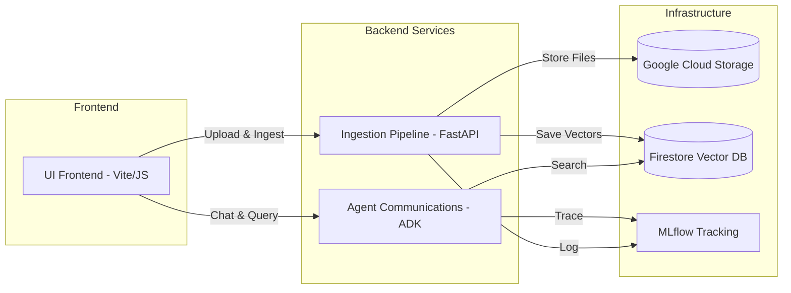
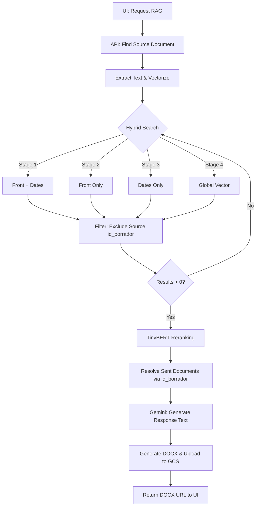

# AI RAG Communications — Engineering Ingestion System

An AI-powered Retrieval-Augmented Generation (RAG) system for processing and querying technical engineering communications. It leverages Clean Architecture, the Pipe & Filter pattern, and the Google Gemini API to extract, embed, and store documents in a Firestore vector database.

---

## 🏗 System Architecture

The system is composed of four independent services that work together:

---

## 🚀 Key Processes

### 1. Document Ingestion (Received & Sent)
The system differentiates between scanned received documents (OCR needed) and native digital sent documents (PDF Reader).

### 2. RAG Retrieval & DOCX Generation
Retrieves similar historical context to generate a draft response.

---

## 🆔 Document Identification & Linking

The system maintains perfect traceability between documents using technical and user-facing identifiers:

| Identifier | Purpose | Firestore Field | Source Column (CSV) |
|---|---|---|---|
| **Draft ID** | Technical link. Connects a received letter to its answer. | `id_borrador` | `Id borradores` |
| **Official Code** | User identity. Code entered in the UI. | `nombre_objeto` | `Recibidas` / `Enviadas` |
| **File Name** | Real name of the document in the storage. | `nombre_archivo` | Extracted from URL |

- **Exclusion Rule:** To ensure high-quality RAG, the system **always excludes** the document being answered (based on `id_borrador`) from the search results.
- **Cross-Collection Link:** For every relevant chunk found in `docs-recibidos`, the system automatically resolves the corresponding response in `docs-enviados` using the `id_borrador`.

---

## 🛠 API Reference (Core Endpoints)

### Ingestion Pipeline (:8080)

*   **`POST /api/v1/upload`**: Uploads a local file to GCS. It automatically creates a folder structure based on the `document_date` (YYYY-MM-DD) and `document_type`. Returns the GCS URL for downstream ingestion.
*   **`POST /api/v1/ingestdocumentreceived`**: Triggers the ingestion for a received document. It uses **Gemini 3 Flash OCR** to extract text from images/scans and extracts engineering metadata.
*   **`POST /api/v1/ingestdocumentsent`**: Triggers the ingestion for a sent document. It uses a **Native PDF Reader** strategy for high-fidelity extraction of digital documents.
*   **`POST /api/v1/ingest/batch`**: Scans the local `Comunicaciones.csv` and ingests all rows. Supports a `?limit=N` parameter for testing specific subsets.
*   **`POST /api/v1/generatedocsent`**: The RAG orchestrator. It takes a received document code, performs a tiered fallback search, reranks results with **TinyBERT**, and returns a generated `.docx` response URL.

### Agent Communications (:8000)

*   **`POST /run`**: The main conversational entry point. It accepts natural language queries, reasons about them, and uses the `search_communications` tool to provide cited answers from the document database.

---

## 🧪 Reranker & Models

- **Embedding:** `models/embedding-001` (768 dimensions).
- **Reranker:** `ms-marco-TinyBERT-L-2-v2` via **FlashRank**. Provides semantic re-ordering of top 20 search results to improve context quality.
- **Resilience:** If the cross-encoder fails, the system automatically falls back to original vector relevance to ensure service availability.

---

## 📈 System Health & Quality

| Component | Test Status | Code Coverage |
|---|---|---|
| **Ingestion Pipeline** | ✅ 108 Passed | 79% |
| **Agent Communications** | ✅ 10 Passed | 50% |
| **UI Frontend** | ✅ Build OK | N/A |

---

## 📖 Setup & Development

Detailed technical specifications are available in the sub-service directories:
- [Ingestion Pipeline Technical Guide](src/ingestion-pipeline/README.md)
- [Agent Communications Technical Guide](src/agent-communications/README.md)
- [UI Frontend Guide](src/ui-ai-comunicados/README.md)
 Technical Guide](src/agent-communications/README.md)
- [UI Frontend Guide](src/ui-ai-comunicados/README.md)
