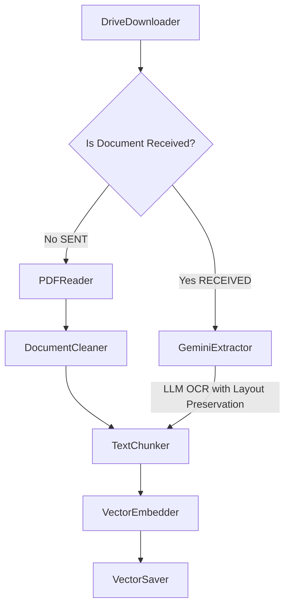

# AI RAG Communications — Ingestion System

An AI-powered Retrieval-Augmented Generation (RAG) system for processing and querying technical engineering communications. It leverages Clean Architecture, the Pipe & Filter pattern, and the Google Gemini API to extract, embed, and store documents in a Firestore vector database.

---

## System Architecture

The system is composed of four independent services that work together:

```
┌─────────────────────┐     ┌──────────────────────┐
│  Ingestion Pipeline │────▶│  Firestore Vector DB  │
│  (FastAPI · :8080)  │     │  (Google Cloud)       │
└─────────────────────┘     └──────────┬───────────┘
                                        │
┌─────────────────────┐                │
│  Agent Communications│◀──────────────┘
│  (ADK · :8000)      │
└──────────┬──────────┘
           │
┌──────────▼──────────┐     ┌──────────────────────┐
│  UI Frontend         │     │  MLflow Tracking     │
│  (Vite · :5173)     │     │  (Server · :5001)    │
└─────────────────────┘     └──────────────────────┘
```

### Ingestion Pipeline — Pipe & Filter Strategy



### Pipeline Components

| Component | Description |
|---|---|
| **DriveDownloader** | Downloads files from Google Drive via Service Account or ADC, with exponential back-off retries. |
| **PDFReader** | Extracts raw digital text from electronic PDFs using PyMuPDF (`fitz`). |
| **DocumentCleaner** | Cleans structural noise and standardizes headers via compiled regular expressions. |
| **GeminiExtractor** | Uses `gemini-2.5-flash` with structured Pydantic outputs to OCR scanned documents. |
| **TextChunker** | Splits cleaned text into semantic chunks using LangChain text splitters. |
| **VectorEmbedder** | Computes embeddings for each chunk using `models/embedding-001`. |
| **VectorSaver** | Persists vectors and metadata into Firestore vector indexes. |

---

## Repository Structure

```text
ai-rag-docs/
├── run_all.sh               # Start/stop all services simultaneously
├── run_mlflow.sh            # Start MLflow tracking server only
├── artifacts/               # Generated reports and analysis
├── specs/                   # Feature specifications and technical plans
│   ├── 001-rag-document-ingestion/
│   ├── 002-csv-metadata-integration/
│   └── 003-drive-ingestion-llm-ocr/
└── src/
    ├── ingestion-pipeline/  # RAG ingestion service (FastAPI · Python)
    ├── agent-communications/# Conversational agent (ADK · Python)
    └── ui-ai-comunicados/   # Frontend chat interface (Vite · JS)
```

---

## Prerequisites

Before running anything, ensure the following tools are installed globally on your machine.

### Required Tools

| Tool | Min. Version | Install |
|---|---|---|
| **Python** | ≥ 3.12 | [python.org](https://www.python.org/downloads/) |
| **uv** | latest | `curl -LsSf https://astral.sh/uv/install.sh \| sh` |
| **Node.js + npm** | ≥ 18 | [nodejs.org](https://nodejs.org/) |
| **Google Cloud SDK** | latest | [cloud.google.com/sdk](https://cloud.google.com/sdk/docs/install) |

### Required Google Cloud Resources

You need a GCP project with the following services enabled and configured:

- **Firestore** (Native mode) — Vector database for document embeddings.
- **Google Cloud Storage** — Bucket for raw document ingestion events.
- **Google Drive API** — To download source documents.
- **Gemini API** — OCR and embedding model calls. Obtain an API key from [aistudio.google.com](https://aistudio.google.com/app/apikey).

### Authentication

Authenticate the Google Cloud SDK for Application Default Credentials (ADC):

```bash
gcloud auth application-default login
gcloud config set project YOUR_PROJECT_ID
```

---

## Setup: One-Time Configuration per Service

Each service requires its own isolated Python environment and `.env` file. Follow these steps **once** after cloning the repository.

### 1. Ingestion Pipeline

```bash
cd src/ingestion-pipeline

# 1a. Copy the environment variable template
cp .env.example .env

# 1b. Edit .env with your real values
#     (See "Environment Variables" section below for reference)
nano .env

# 1c. Install dependencies and create the virtual environment
uv sync
```

**Environment Variables (`src/ingestion-pipeline/.env`):**

| Variable | Required | Description | Example |
|---|---|---|---|
| `GCP_PROJECT_ID` | ✅ | Your Google Cloud project ID | `my-project-id` |
| `GCP_REGION` | ✅ | Deployment region | `us-central1` |
| `GCS_INGESTION_BUCKET` | ✅ | GCS bucket for Eventarc triggers | `communications-bucket` |
| `GCS_INGESTION_PREFIX` | ✅ | Subfolder filter inside the bucket | `COMMUNICATION_RECEIVED/` |
| `FIRESTORE_DATABASE` | ❌ | Firestore database name | `(default)` |
| `GEMINI_API_KEY` | ✅ | Gemini API key | `AIzaSy...` |
| `GEMINI_OCR_MODEL` | ❌ | OCR model name | `gemini-2.5-flash` |
| `EMBEDDING_MODEL` | ❌ | Embedding model name | `models/embedding-001` |
| `DRIVE_SERVICE_ACCOUNT_PATH` | ❌ | Path to Drive SA JSON (uses ADC if empty) | `./sa-key.json` |
| `GCS_OUTPUT_BUCKET` | ❌ | GCS bucket for generated response PDFs | `my-output-bucket` |
| `GCS_OUTPUT_PREFIX` | ❌ | Prefix path inside the output bucket | `documentos_correspondencia/` |
| `LOG_LEVEL` | ❌ | Python log level | `INFO` |

### 2. Agent Communications

```bash
cd src/agent-communications

# 2a. Install dependencies
agents-cli install
# If agents-cli is not installed: uv tool install google-agents-cli

# 2b. Configure your environment
#     The agent reads credentials from ADC — no .env.example needed.
#     Verify the .env file already present has the right project and region.
cat .env
```

### 3. UI Frontend

```bash
cd src/ui-ai-comunicados

# Install Node.js dependencies
npm install
```

---

## Running the System

### Option A — Run All Services at Once (Recommended)

From the **repository root**, run a single command to start all four services in parallel. Logs are written to `.pids/*.log`.

```bash
# Start all services
./run_all.sh
```

Services will be available at:

| Service | URL |
|---|---|
| MLflow Tracking Dashboard | http://localhost:5001 |
| Ingestion Pipeline API | http://localhost:8080 |
| Agent Communications API | http://localhost:8000 |
| UI Frontend | http://localhost:5173 |

```bash
# Stop all services
./run_all.sh stop
# Alternatively, press Ctrl+C in the terminal running run_all.sh
```

> **Tip:** Check live logs for any service with:
> ```bash
> tail -f .pids/ingestion.log   # Ingestion Pipeline
> tail -f .pids/agent.log       # Agent
> tail -f .pids/ui.log          # UI Frontend
> tail -f .pids/mlflow.log      # MLflow
> ```

---

### Option B — Run Services Individually

Use this approach for development or debugging a specific service.

#### MLflow Tracking Server

```bash
# From the repository root
./run_mlflow.sh
```

> ✅ Access at **http://localhost:5001**
> ❌ Do **not** use `http://0.0.0.0:5001` — it triggers DNS rebinding protection.

MLflow data is persisted in `./mlflow.db` and `./mlartifacts/`.

---

#### Ingestion Pipeline (FastAPI)

```bash
cd src/ingestion-pipeline
uv run python -m uvicorn src.main:app --host 0.0.0.0 --port 8080 --reload
```

> API available at **http://localhost:8080**
> Interactive docs at **http://localhost:8080/docs**

---

#### Agent Communications (ADK)

```bash
cd src/agent-communications

# Run with the ADK playground (recommended for local testing)
agents-cli playground

# Or run the FastAPI server directly
uv run python app/fast_api_app.py
```

> Agent playground at **http://localhost:8000**

---

#### UI Frontend (Vite)

```bash
cd src/ui-ai-comunicados
npm run dev
```

> UI available at **http://localhost:5173**

---

## API Reference

### Ingestion Pipeline Endpoints

#### `GET /health`
Service health check.
```bash
curl http://localhost:8080/health
# → {"status": "ok"}
```

#### `POST /api/v1/ingest`
Single document ingestion with metadata.
```bash
curl -X POST http://localhost:8080/api/v1/ingest \
  -H "Content-Type: application/json" \
  -d '{
    "url": "https://drive.google.com/file/d/...",
    "document_type": "received",
    "metadata": {
      "sender": "CYS",
      "contract_number": "CW 123",
      "work_front": "Descarga",
      "document_date": "26/02/2025",
      "process": "Supervisión",
      "response_file_url": "https://drive.google.com/file/d/..."
    }
  }'
```

#### `POST /api/v1/ingest/batch`
Batch ingestion of all rows in the configured CSV file.
```bash
curl -X POST http://localhost:8080/api/v1/ingest/batch
# → {"status": "completed", "processed_records": 12, "total_records": 12}
```

---

## Running Tests

### Ingestion Pipeline Tests

```bash
cd src/ingestion-pipeline

# Run all tests
uv run python -m pytest tests/ -v

# Run with coverage report (currently at ~79% coverage)
uv run python -m pytest --cov=src tests/
```

### Agent Communications Tests

```bash
cd src/agent-communications
uv run pytest tests/unit tests/integration
```

---

## Utility Scripts

### Ingestion Metrics Measurement

Processes rows 100–200 of the CSV and captures token counts, latency, and API costs. Results are logged to MLflow and written to `artifacts/ingest_metrics_report.md`.

```bash
cd src/ingestion-pipeline
uv run python scripts/ingest_rows_100_200_metrics.py
```

### Firestore Index Setup

Create the required Firestore composite and vector indexes before running ingestion:

```bash
cd src/ingestion-pipeline

# Create composite indexes (required for metadata queries)
./scripts/create_composite_indexes.sh

# Create the KNN vector index (required for RAG similarity search)
./scripts/create_vector_index.sh
```

---

## Feature History

| Feature | Goal | Status |
|---|---|---|
| [001 — RAG Document Ingestion](specs/001-rag-document-ingestion/spec.md) | Pipe & Filter pipeline: extract, embed, and save to Firestore. | ✅ Completed |
| [002 — CSV Metadata & Batch API](specs/002-csv-metadata-integration/spec.md) | Batch ingestion via CSV + FastAPI endpoint. | ✅ Completed |
| [003 — Drive Ingestion & LLM OCR](specs/003-drive-ingestion-llm-ocr/spec.md) | Google Drive download + Gemini OCR for scanned documents. | ✅ Completed |

---

## Cost Analysis

For a detailed breakdown of token usage, API costs, and infrastructure cost projections (Cloud Storage, Firestore, Cloud Run, Gemini API) for 30 active users per month, see the [Ingestion Metrics Report](artifacts/ingest_metrics_report.md).
