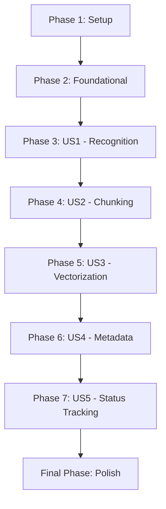

# Tasks: RAG Document Ingestion

**Feature**: `001-rag-document-ingestion` | **Strategy**: MVP First, Pipe & Filter Implementation

## Dependency Graph

## Phase 1: Setup
Goal: Project initialization and environment configuration.
- [x] T001 Initialize project structure in `src/ingestion-pipeline/` (src, tests, Dockerfile)
- [x] T002 [P] Configure Python environment with `uv` inside `src/ingestion-pipeline/`
- [x] T003 [P] Setup GCP configuration and `.env.example` in `src/ingestion-pipeline/`

## Phase 2: Foundational
Goal: Core infrastructure and base classes for the Pipe & Filter architecture.
- [x] T004 Implement GCS Repository in `src/ingestion-pipeline/repositories/storage_repo.py`
- [x] T005 Implement Firestore Repository in `src/ingestion-pipeline/repositories/document_repo.py`
- [x] T006 [P] Implement base Filter and Pipeline in `src/ingestion-pipeline/filters/base.py`

## Phase 3: [US1] Document Recognition & Statusing
Goal: Receive storage events and initialize document tracking.
- [x] T007 [US1] Implement Ingestion Request payload validation per contract in `src/domain/schemas.py`
- [x] T008 [US1] Create FastAPI endpoint to receive storage events in `src/ingestion-pipeline/main.py`
- [x] T009 [US1] Implement `IngestDocumentCommand` to initialize source record and trigger pipe in `src/ingestion-pipeline/usecases/ingest_document.py`

## Phase 4: [US2] Text Extraction & Chunking
Goal: Extract text and metadata, and split into structured chunks.
- [x] T010 [US2] Implement `DocumentReader` filter using Gemini to extract text and primary metadata (`sender`, `contract_number`, `work_front`, `document_date`, `process`, `response_file_url`)
- [x] T011 [US2] Implement `TextChunker` filter using LangChain to generate `subject` and `body` fields for each semantic chunk
- [ ] T012 [P] [US2] Create unit tests for chunking logic in `tests/unit/test_chunker.py`

## Phase 5: [US3] Embedding Generation & Storage
Goal: Generate vector embeddings and store them in Firestore.
- [x] T013 [US3] Implement `VectorEmbedder` filter using `gemini-embedding-001` in `src/filters/embedder.py`
- [x] T014 [US3] Implement `VectorSaver` filter to store chunks in Firestore indices in `src/filters/saver.py`
- [ ] T015 [P] [US3] Configure Firestore Vector Index via CLI/setup script in `infrastructure/setup_firestore.sh`

## Phase 6: [US4] Metadata Indexing & Linking
Goal: Ensure all chunks are properly tagged and searchable by metadata.
- [x] T016 [US4] Implement metadata mapping logic in `VectorSaver` to include contract and sender info
- [x] T017 [US4] Ensure all chunks are linked to `SourceDocument` via `sourceId`
- [ ] T018 [P] [US4] Create integration test for end-to-end vector retrieval in `tests/integration/test_retrieval.py`

## Phase 7: [US5] Automated Notifications & Status Tracking
Goal: Finalize pipeline status and ensure monitoring is available.
- [x] T019 [US5] Implement status update logic for the `SourceDocument` (COMPLETED/FAILED) in the Pipe orchestrator
- [x] T020 [US5] Add robust logging (at each filter step) in `src/infrastructure/logging.py`
- [x] T021 [P] [US5] Final verification check of API status endpoints for the Processing Dashboard

## Final Phase: Polish
Goal: Cleanup and documentation.
- [ ] T022 Documentation update: Update `quickstart.md` with final service URLs and setup steps
- [ ] T023 Final sanity check and code formatting with `ruff` and `black`

## Parallel Execution Opportunities
- T002, T003 (Environment setup)
- T006 (Architecture) can be built in parallel with Repository implementations (T004, T005)
- Unit tests (T012) and Index configuration (T015) can run alongside implementation.
- Metadata linking (T016-T018) is largely independent of status tracking (T019-T021) once core storage works.

## Implementation Strategy
- **MVP**: Focus on US1, US2, and US3 to get a file from GCS to a vector in Firestore.
- **Incremental**: Add Metadata Enrichment (US4) and Monitoring (US5) once the core path is stable.
