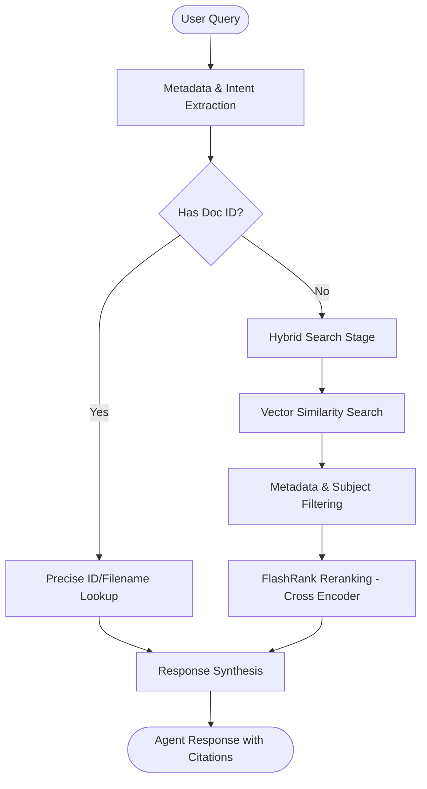

# agent-documents

Conversational Agent for technical project communications using **Agentic RAG**.
Generated with `agents-cli` and built on top of the Google Agent Development Kit (ADK).

## 🚀 Key Features (Agentic RAG)

This agent is not just a simple search tool; it implements a reasoning cycle to provide high-precision engineering context:

-   **Intelligent Metadata Extraction**: Automatically identifies work fronts from natural language.
-   **Chronological Filtering**: Can restrict searches to specific months and years (e.g., "comunicaciones de mayo 2025").
-   **Subject-Matter Focus**: Supports targeted searching within document subjects using a hybrid approach (Vector + Keyword).
-   **Traceability**: Mandatory citation of **Document Codes** (e.g., `CYS-CW276532-PHI-03362`) in every response.
-   **Closed-Loop Discovery**: Automatically links received documents with their official sent responses.

## 🛠 Retrieval Strategy

The agent follows a multi-stage retrieval flow to ensure accuracy:



## Project Structure

```
agent-communications/
├── app/         # Core agent code
│   ├── agent.py               # Main agent logic & Instructions
│   ├── tools.py               # Search tools & Hybrid Retrieval logic
│   ├── fast_api_app.py        # FastAPI Backend server
│   └── app_utils/             # App utilities and helpers
├── tests/                     # Unit, integration, and evalsets
├── .env                       # Local environment configuration
└── pyproject.toml             # Project dependencies (uv)
```

## Requirements

- **uv**: Python package manager.
- **agents-cli**: Install with `uv tool install google-agents-cli`.
- **Google Cloud SDK**: Authenticated with `gcloud auth application-default login`.

## Quick Start

1. **Install dependencies**:
   ```bash
   agents-cli install
   ```

2. **Run local playground**:
   ```bash
   agents-cli playground
   ```

3. **Run tests**:
   ```bash
   uv run pytest tests/unit tests/integration
   ```

## Retrieval Tools

### `search_communications`
The primary tool used by the agent. It performs:
1.  **Vector Search**: Finds semantically similar chunks in Firestore.
2.  **Hybrid Filtering**: Applies hard filters (Work Front) and soft filters (Subject substring, Date ranges).
3.  **Reranking**: Uses `ms-marco-MiniLM-L-12-v2` to prioritize the most relevant results.
4.  **Response Linking**: Queries the sent-documents database to find associated answers.

## Deployment

```bash
gcloud config set project <your-project-id>
agents-cli deploy
```

Built-in telemetry exports to Cloud Trace, BigQuery, and Cloud Logging via ADK observability.

## 🧪 Testing & Coverage

To execute the tests and generate a coverage report:

1. **Install coverage tool**:
   ```bash
   uv pip install pytest-cov
   ```

2. **Run tests**:
   ```bash
   # Quick tests (offline/mocked)
   uv run pytest tests/ --cov=app

   # Full integration tests (with real Firestore connection)
   export RUN_FIRESTORE_TESTS="true"
   uv run pytest tests/ --cov=app
   ```

### Coverage Report (50% Total Coverage with real Firestore)
- `app/agent.py`: **100%**
- `app/tools.py`: **67%** (retrieval logic and hybrid search)
- `app/fast_api_app.py`: **0%** (HTTP endpoints run in a separate subprocess via `uvicorn` and are not traced by pytest-cov)
- **Total Coverage**: **50%**
