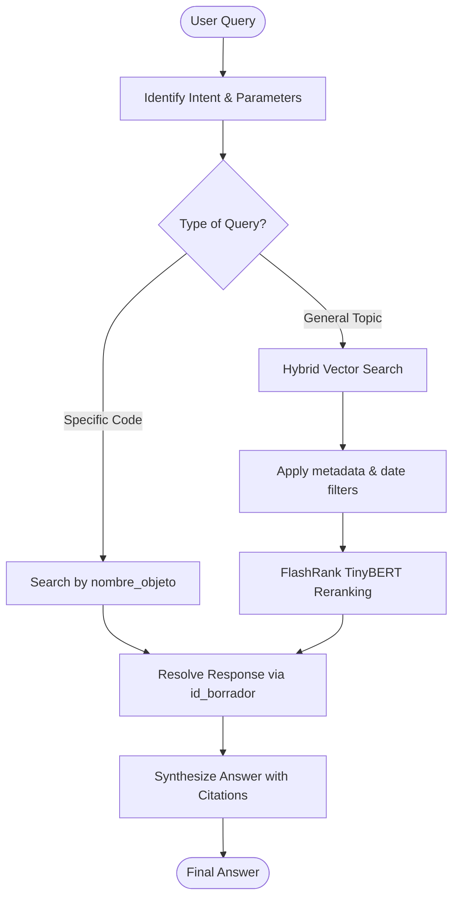

# Agent Communications Service

An **Agentic RAG** conversational service for technical project management. Built using the Google Agent Development Kit (ADK), it provides a reasoning-based interface to the engineering document database.

---

## 🚀 Agent Reasoning Cycle

The agent doesn't just search; it plans and verifies.



---

## 🛠 Retrieval Tools

### `search_communications`
The core tool that powers the agent's knowledge.

1.  **Stage 1: Intent Mapping**: Converts natural language dates (e.g., "mayo 2025") and places (e.g., "Casa de Máquinas") into query parameters.
2.  **Stage 2: Hybrid Lookup**: Uses tiered Firestore queries:
    *   `code_only`: Searches strictly by `nombre_objeto`.
    *   `subject_only`: Searches by `asunto` keyword.
    *   `vector_only`: Pure semantic vector search.
3.  **Stage 3: Cross-Encoder Reranking**: Re-orders the top 20 candidates using the `ms-marco-TinyBERT-L-2-v2` model to improve semantic relevance.
4.  **Stage 4: Traceability Link**: Automatically queries the `docs-enviados` collection using the `id_borrador` of the found chunks to find the official response.

---

## 🔌 API Documentation

The agent is exposed via the ADK FastAPI wrapper.

### 1. Conversational Run (`POST /run`)
Executes a reasoning turn for the AI Agent. This is the endpoint called by the chat UI.

*   **Request Payload**:
    ```json
    {
      "user_input": "Busca el documento REC-001 y dime si ya se respondió.",
      "session_id": "optional-uuid"
    }
    ```
*   **Success Response**: A structured JSON containing the agent's thoughts, the tools it called, and the final response text.
*   **Logic**:
    1.  Extracts the document code "REC-001".
    2.  Invokes `search_communications(document_code="REC-001")`.
    3.  Finds the chunk with `nombre_objeto="REC-001"`.
    4.  Retrieves the linked sent document via its `id_borrador`.
    5.  Synthesizes the final answer.

---

## 🆔 Document Traceability Rules

Every response from the agent **MUST** follow these identification rules:

*   **Nombre Objeto:** The official communication code (e.g., `REC-001`). This is what the user sees.
*   **ID Borrador:** The hidden technical link used to connect a received document to its sent response.

**Example Response Pattern:**
> "He encontrado la comunicación recibida **REC-001** (Asunto: Diseño de Viga). La respuesta enviada fue la **SEN-999**, donde se aprobaron los planos..."

---

## 🧪 Development & Testing

### Running the Playground
Test the agent's behavior in an interactive terminal:
```bash
agents-cli playground
```

### Unit Tests
Verify tool logic and filtering:
```bash
uv run pytest tests/unit/test_tools.py
```
