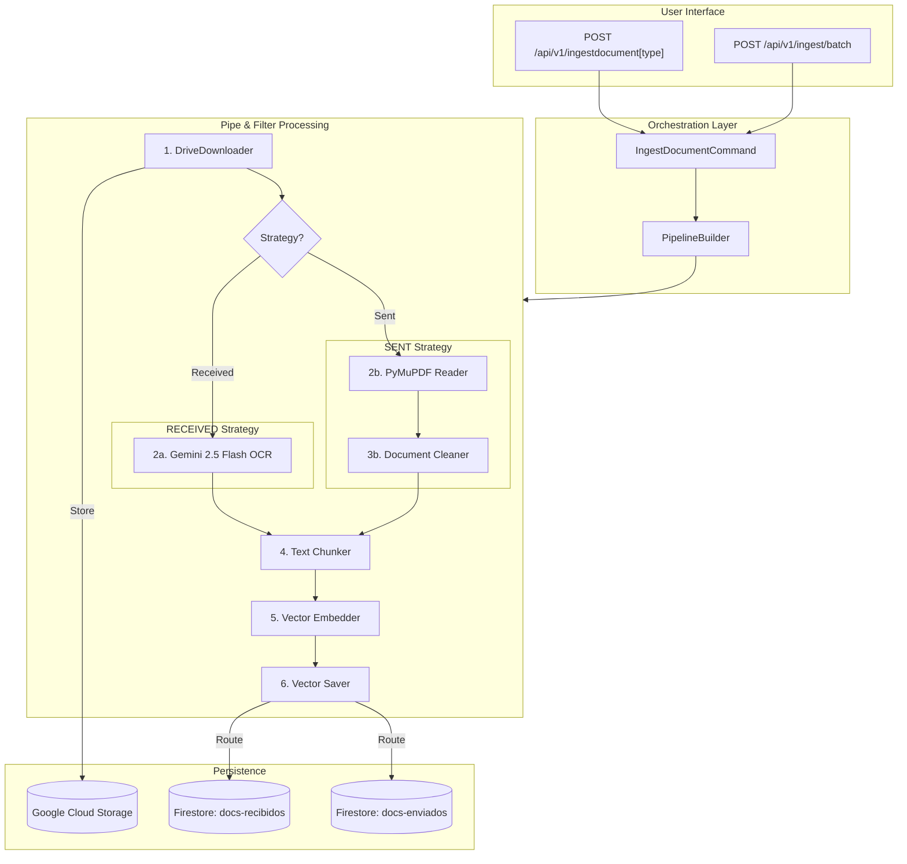

# Ingestion Pipeline Service

The Ingestion Pipeline is a high-performance asynchronous flow designed to process engineering technical documents and correspondence. It operates under a Clean Architecture using the **Pipe and Filter** pattern.

---

## 🏗 Pipeline Architecture

The system uses a strategy-based approach to select the best extraction method based on the document type.



---

## 🔌 API Documentation

### 1. File Upload (`POST /api/v1/upload`)
Uploads a local file directly to Google Cloud Storage (GCS) and organizes it into date-based subfolders. This is the first step in the manual ingestion UI.

*   **Query Parameters**:
    *   `document_date` (string, optional): The document's date (format: YYYY-MM-DD or DD/MM/YYYY). Used for folder naming.
    *   `document_type` (string, optional): Either `received` or `sent`. Defaults to `received`.
*   **Request Body**: `multipart/form-data` containing the file under the key `file`.
*   **Success Response (200 OK)**:
    ```json
    {
      "status": "success",
      "gcs_url": "gs://communications-cys/COMMUNICATIONS_RECEIVED/2026-06-08/filename.pdf",
      "filename": "filename.pdf"
    }
    ```
*   **Internal Logic**:
    1.  Receives file stream.
    2.  Normalizes `document_date` to YYYY-MM-DD.
    3.  Selects GCS prefix based on `document_type`.
    4.  Uploads to the landing zone bucket.

---

### 2. Ingest Received Document (`POST /api/v1/ingestdocumentreceived`)
Triggers the full RAG ingestion pipeline for a document that was received. This endpoint **forces** the use of the **Gemini OCR Strategy**, which is ideal for scanned PDFs or images.

*   **Request Body (JSON)**:
    ```json
    {
      "work_front": "Frente de obra (ej. Descarga)",
      "document_date": "Fecha del documento (ej. 2026-06-08)",
      "id_borrador": "Identificador técnico (ej. 76857089)",
      "cod_document": "Código oficial (ej. REC-001)",
      "document_type": "received",
      "url_doc": "URL de GCS o Google Drive"
    }
    ```
*   **Success Response (200 OK)**:
    ```json
    {
      "status": "completed",
      "received_document": {
        "document_id": "76857089_REC",
        "filename": "test.pdf",
        "cod_document": "REC-001",
        "document_type": "received"
      },
      "sent_document": null
    }
    ```
*   **Internal Logic**:
    1.  Validates and cleans input.
    2.  Sets `nombre_objeto` in Firestore to the value of `cod_document`.
    3.  Executes Gemini-powered OCR and metadata extraction.
    4.  Generates vector embeddings (768d).
    5.  Persists the document and its chunks in the `docs-recibidos` database.

---

### 3. Ingest Sent Document (`POST /api/v1/ingestdocumentsent`)
Similar to the previous endpoint, but tailored for **Sent Documents**. This endpoint **forces** the use of the **Native PDF Reader Strategy**, assuming the document is digital and text-searchable.

*   **Request Body (JSON)**: Same fields as Ingest Received.
*   **Success Response (200 OK)**:
    ```json
    {
      "status": "completed",
      "received_document": null,
      "sent_document": {
        "document_id": "76857089_SEN",
        "filename": "test.pdf",
        "cod_document": "SEN-999",
        "document_type": "sent"
      }
    }
    ```
*   **Internal Logic**:
    1.  Uses `PyMuPDF` for fast and precise text extraction.
    2.  Applies a `DocumentCleaner` filter to remove noise.
    3.  Persists results in the `docs-enviados` database.

---

### 4. Batch Ingestion (`POST /api/v1/ingest/batch`)
Triggers the ingestion of multiple records from a pre-configured local `Comunicaciones.csv` file. Useful for mass data migration.

*   **Query Parameters**:
    *   `limit` (int, optional): Process only the first N rows of the CSV.
*   **Success Response (200 OK)**:
    ```json
    {
      "status": "completed",
      "processed_records": 10,
      "total_records": 100,
      "limit_applied": 10
    }
    ```

---

### 5. RAG Retrieval & DOCX Generation (`POST /api/v1/generatedocsent`)
The primary endpoint for generating draft responses based on historical context. It performs a multi-stage search and uses Gemini to synthesize a new document.

*   **Request Body (JSON)**:
    ```json
    {
      "received_communication_code": "REC-001",
      "received_document_id": "76857089",
      "front": "Frente de obra (opcional)",
      "start_date": "YYYY-MM-DD (opcional)",
      "end_date": "YYYY-MM-DD (opcional)"
    }
    ```
*   **Success Response (200 OK)**:
    ```json
    {
      "status": "completed",
      "subject": "Asunto detectado",
      "similar_count": 7,
      "sent_count": 2,
      "gcs_url": "gs://communications-cys/COMMUNICATIONS_SENT_TMP/2026-06-08/respuesta_...docx"
    }
    ```
*   **Internal Logic**:
    1.  **Source Identification**: Locates the base document using `cod_document` or `id_borrador`.
    2.  **Tiered Fallback Search**: Executes a hybrid vector search with 4 stages (Front+Date -> Front -> Date -> Global).
    3.  **Exclusion**: Always excludes chunks from the same `id_borrador`.
    4.  **Reranking**: Uses **TinyBERT** to select the top 7 context fragments.
    5.  **Generation**: Gemini synthesizes the draft.
    6.  **Storage**: Generates a `.docx` file and uploads it to a date-partitioned folder in GCS.

---

## 🛠 Advanced Features

### Robust RAG Fallback
The `generatedocsent` endpoint implements a 4-stage fallback logic to ensure the IA always has context, even if strict filters return zero results.

### Unified Engine
The system is standardized on **`gemini-3-flash-preview`** for all reasoning, extraction (OCR), and synthesis tasks to ensure maximum intelligence and consistency.

### Semantic Reranking
Uses **FlashRank** with `ms-marco-TinyBERT-L-2-v2`. If the ONNX inference fails for any reason, the system automatically falls back to the original vector search relevance to ensure zero downtime.

---

## 📊 Code Coverage

Última actualización de métricas de cobertura (Unit Tests):

* `embedder.py`: **96% Cobertura**
* `document_repo.py`: **60% Cobertura**
* `vector_search_repo.py`: **81% Cobertura**
* `retrieve_and_generate.py`: **90% Cobertura**
* `docx_generator.py`: **99% Cobertura**
* **Total Proyecto**: **79% Cobertura**
