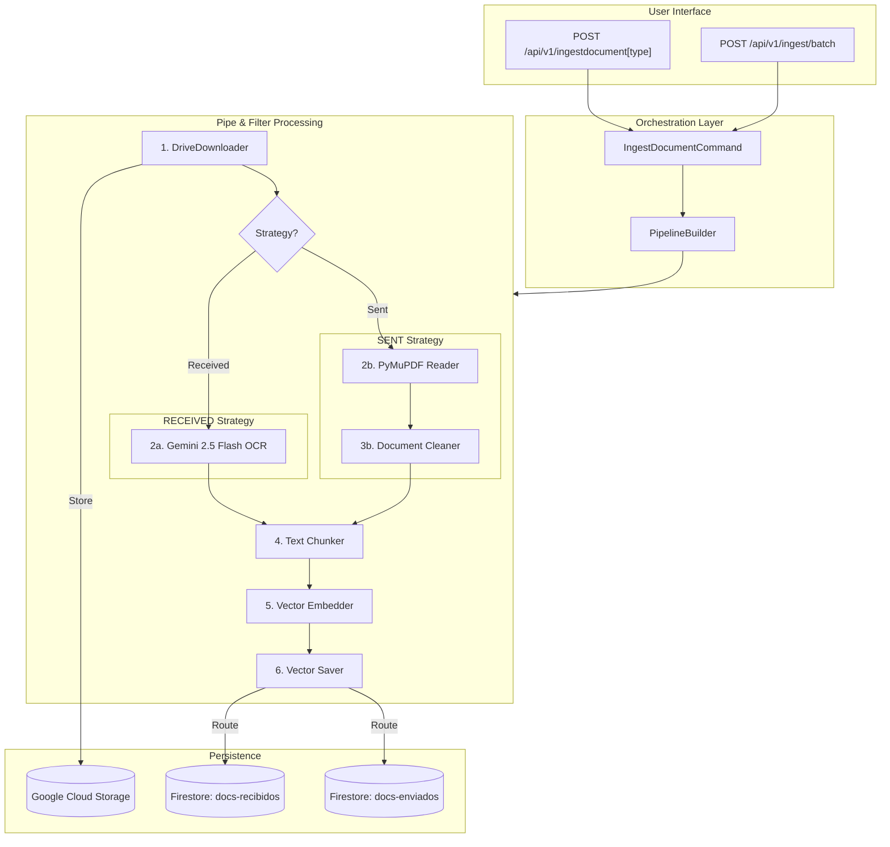

# Ingestion Pipeline Service

The Ingestion Pipeline is a high-performance asynchronous flow designed to process engineering technical documents and correspondence. It operates under a Clean Architecture using the **Pipe and Filter** pattern.

---

## 🏗 Pipeline Architecture

The system uses a strategy-based approach to select the best extraction method based on the document type.



---

## 🔌 API Documentation

### 1. File Upload
**`POST /api/v1/upload`**
Uploads a file to GCS organized by date and type.
*   **Query Params:** `document_date` (optional), `document_type` (received/sent).
*   **Response:** `{"status": "success", "gcs_url": "gs://...", "filename": "..."}`

### 2. Ingest Received Document
**`POST /api/v1/ingestdocumentreceived`**
Processes a document using the Gemini OCR strategy.
*   **Payload:**
    ```json
    {
      "work_front": "Descarga",
      "document_date": "2026-06-08",
      "id_borrador": "76857089",
      "cod_document": "REC-001",
      "document_type": "received",
      "url_doc": "https://drive.google.com/..."
    }
    ```

### 3. Ingest Sent Document
**`POST /api/v1/ingestdocumentsent`**
Processes a document using the native PDF Reader strategy.
*   **Payload:** Same as Received, but `document_type` is forced to `sent`.

### 4. Batch Ingestion
**`POST /api/v1/ingest/batch`**
Processes rows from the local `Comunicaciones.csv`.
*   **Query Params:** `limit` (int) - Optional rows limit.
*   **Response:** `{"status": "completed", "processed_records": 10, "limit_applied": 10}`

### 5. RAG Retrieval & Generation
**`POST /api/v1/generatedocsent`**
The "magic" endpoint that finds context and generates a DOCX.
*   **Payload:**
    ```json
    {
      "received_communication_code": "REC-001",
      "received_document_id": "1111",
      "front": "Optional filter",
      "start_date": "YYYY-MM-DD",
      "end_date": "YYYY-MM-DD"
    }
    ```
*   **Response:** `{"docx_bytes": "...", "gcs_url": "gs://...", "similar_count": 7, "sent_count": 2}`

---

## 🛠 Advanced Features

### Robust RAG Fallback
The `generatedocsent` endpoint implements a 4-stage fallback logic:
1.  **Strict:** Filters by `Front` + `Date Range`.
2.  **Locality:** Filters by `Front` only.
3.  **Temporal:** Filters by `Date Range` only.
4.  **Global:** Pure semantic search across all documents.
*Note: Always excludes the source document's `id_borrador` to avoid self-referencing.*

### Semantic Reranking
Uses **FlashRank** with `ms-marco-TinyBERT-L-2-v2` to ensure the most relevant context is sent to the LLM. Fallback to vector order is automatic if ONNX fails.
