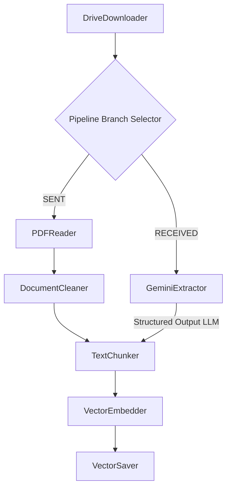

# Ingestion Pipeline Service

The Ingestion Pipeline Service is a containerized, high-performance asynchronous pipeline engineered to process technical engineering documents and communications. It operates under a clean Pipe and Filter architecture, applying conditional parsing strategies depending on the source classification of each document.

---

## Core Features

* **Hybrid Ingestion Architectures**:
  * **Sent Documents (SENT)**: Processed via high-precision structural extraction using local PDF reading and compiled regular expression routines (`PDFReader` + `DocumentCleaner`).
  * **Received Documents (RECEIVED)**: Processed via LLM-based OCR using `gemini-2.5-flash` and custom prompt guidelines designed to preserve tables and document layouts (`GeminiExtractor`).
* **Multi-Source Ingest Options**:
  * **GCS Eventarc**: Triggered automatically when documents are written to Google Cloud Storage.
  * **CSV Batch API**: Initiates a high-speed batch execution that loops through a designated metadata table.
  * **Single Document API**: Provides synchronous, on-demand ingestion for single items with dynamic URL cross-mapping.
* **Resilient Infrastructure**:
  * **Google Drive API Downloader**: Natively streams files using service account tokens, supporting automatic retries with exponential back-off and diagnostic reporting for forbidden (403) or missing (404) URLs.
  * **Persistence Integrity**: Records vectors and primary schemas into Google Firestore databases.

---

## Configuration

To run the application locally or in a container, duplicate the configuration template and populate the variables:

```bash
cp .env.example .env
```

### Environment Variables

| Variable | Type | Description | Required |
|---|---|---|---|
| `GCP_PROJECT_ID` | String | Google Cloud Project Identifier | Yes |
| `GCP_REGION` | String | Cloud Run and Service Deployment Region | Yes |
| `GCS_INGESTION_BUCKET`| String | Target GCS bucket for document ingestion events | Yes |
| `GCS_INGESTION_PREFIX`| String | GCS sub-directory prefix filter | Yes |
| `FIRESTORE_DATABASE` | String | Firestore Target Database Name (defaults to `(default)`) | No |
| `GEMINI_API_KEY` | String | Authentication key for Google Gemini model calls | Yes |
| `GEMINI_OCR_MODEL` | String | Target model for LLM OCR (default: `gemini-2.5-flash`) | No |
| `EMBEDDING_MODEL` | String | Target model for vectors (default: `models/embedding-001`) | No |
| `DRIVE_SERVICE_ACCOUNT_PATH` | String | Local file path to Google Drive Service Account JSON | No* |
| `LOG_LEVEL` | String | Python logger severity level (`DEBUG`, `INFO`, `ERROR`) | No |

*Note: If `DRIVE_SERVICE_ACCOUNT_PATH` is left blank, the application will default to Google Application Default Credentials (ADC).*

---

## Technical Architecture

The ingestion process is decoupled into isolated filters that share a common state within a `ProcessingPayload`. The pipeline selects a strategy based on the document type:



---

## API Documentation

The ingestion service is exposed via FastAPI:

### GET `/health`
Returns service availability status.
* **Response**: `{"status": "ok"}`

### POST `/api/v1/ingest`
Triggers synchronous ingestion for a single document with metadata. Supports dynamic URL cross-mapping.
* **Payload Structure**:
  ```json
  {
    "url": "https://drive.google.com/...",
    "document_type": "received",
    "metadata": {
      "sender": "CYS",
      "contract_number": "CW 123",
      "work_front": "Descarga",
      "document_date": "26/02/2025",
      "process": "Supervisión",
      "response_file_url": "https://drive.google.com/..."
    }
  }
  ```
* **Response**: `{"status": "completed", "document_id": "...", "filename": "...", "document_type": "received"}`

### POST `/api/v1/ingest/batch`
Triggers the batch ingestion of all documents recorded in the local CSV file configured in the settings.
* **Response**:
  ```json
  {
    "status": "completed",
    "processed_records": 12,
    "total_records": 12
  }
  ```

---

## Running and Verifying Tests

The project utilizes a `uv` workspace to enforce package integrity. To prevent target environment namespace shadowing and run unit/integration suites successfully, use the python module executor flag:

```bash
cd src/ingestion-pipeline
uv run python -m pytest tests/ -v
```

This guarantees execution is bound to the isolated Python 3.14.2 environment and dependencies loaded within the `.venv` directory.

To run the test suite with coverage reporting (currently maintaining **79% Total Coverage**):
```bash
uv run python -m pytest --cov=src tests/
```
