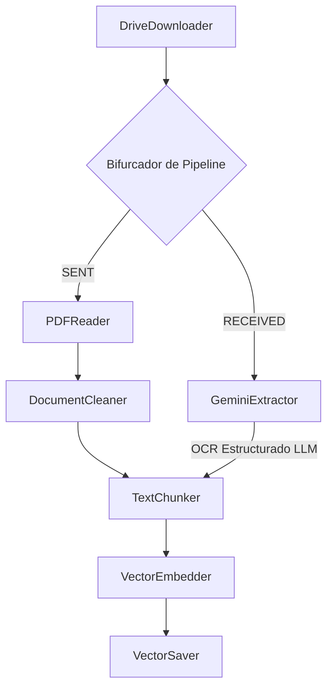

# Servicio de Pipeline de Ingesta (Ingestion Pipeline)

El Servicio de Pipeline de Ingesta es un flujo asíncrono y de alto rendimiento diseñado para procesar documentos técnicos y correspondencia de ingeniería. Opera bajo una arquitectura limpia de Tuberías y Filtros (Pipe and Filter), aplicando estrategias de extracción condicional dependiendo de la clasificación de origen de cada documento.

---

## Características Principales

* **Restricción de Columnas CSV (7 Columnas)**:
  * El pipeline de ingesta masiva (`/api/v1/ingest/batch`) procesa estrictamente las **7 columnas principales** del archivo `Comunicaciones.csv`, ignorando cualquier columna adicional:
    1. `Id borradores` (Mapeado como `draft_id`)
    2. `Fecha` (Mapeado como `document_date`)
    3. `Frente` (Mapeado como `work_front`)
    4. `Recibidas` (Nombre del archivo recibido)
    5. `url Recibidas` (URL de Google Drive del archivo recibido)
    6. `Enviadas` (Nombre del archivo enviado/respuesta)
    7. `Ubicacion filtradas` (URL de Google Drive del archivo enviado)
* **Valores Predeterminados (Fallbacks)**:
  * Si faltan campos mandatorios en una fila del CSV, el pipeline aplica valores por defecto automáticamente:
    * `draft_id` (Id borradores): Si está vacío, se autogenera un Hash MD5 único a partir del contenido de la fila.
    * `document_date` (Fecha): Si está vacío, se establece por defecto como `"UNKNOWN"`.
    * `work_front` (Frente): Si está vacío, se establece por defecto como `"GENERAL"`.
* **Procesamiento Independiente y Regla de Omisión (Skip Rule)**:
  * Las columnas de recibidos (`url Recibidas`) y enviados (`Ubicacion filtradas`) en una misma fila se procesan de forma **completamente independiente**.
  * Si la URL de un documento contiene `"Sin ruta"`, `"Sin URL origen"` o es `"UNKNOWN"`, **no se realiza ningún procesamiento** para ese documento (se salta la descarga de Google Drive, no se crea el registro en Firestore, no se generan fragmentos de texto ni se guarda en la base de datos).
  * Si una fila tiene una URL válida en Recibidos y una URL inválida (o `"Sin ruta"`) en Enviados, se ingesta y se guarda únicamente el documento recibido en la base de datos de recibidos, saltándose por completo el documento enviado (y viceversa).
* **Arquitectura de Ingesta Híbrida**:
  * **Documentos Enviados (SENT)**: Extraídos mediante lectura estructural de PDF en local usando expresiones regulares especializadas (`PDFReader` + `DocumentCleaner`).
  * **Documentos Recibidos (RECEIVED)**: Extraídos mediante OCR impulsado por LLM utilizando `gemini-2.5-flash` con instrucciones de diseño visual para preservar tablas y maquetación (`GeminiExtractor`).

---

## Configuración

Para ejecutar la aplicación localmente o dentro de un contenedor, duplique la plantilla de configuración y defina las variables requeridas:

```bash
cp .env.example .env
```

### Variables de Entorno

| Variable | Tipo | Descripción | Requerido |
|---|---|---|---|
| `GCP_PROJECT_ID` | String | Identificador del proyecto de Google Cloud | Sí |
| `GCP_REGION` | String | Región de despliegue de Cloud Run | Sí |
| `GCS_INGESTION_BUCKET`| String | Bucket de GCS destino para eventos de ingesta | Sí |
| `GCS_INGESTION_PREFIX`| String | Prefijo de subdirectorio en GCS | Sí |
| `FIRESTORE_DATABASE` | String | Base de datos de Firestore por defecto (inicializada como `(default)`) | No |
| `GEMINI_API_KEY` | String | API Key de Google Gemini para llamadas al modelo de IA | Sí |
| `EMBEDDING_MODEL` | String | Modelo para generación de vectores (por defecto: `gemini-embedding-2`) | No |
| `OCR_MODEL` | String | Modelo de LLM para OCR visual (por defecto: `gemini-2.5-flash`) | No |
| `LOG_LEVEL` | String | Nivel de severidad del Logger de Python (`DEBUG`, `INFO`, `ERROR`) | No |
| `FIRESTORE_DATABASE_RECEIVED`| String | Base de datos de Firestore destino para Recibidos (`docs-recibidos`) | Sí |
| `FIRESTORE_DATABASE_SENT`| String | Base de datos de Firestore destino para Enviados (`docs-enviados`) | Sí |

---

## Arquitectura Técnica

El flujo de ingesta se desacopla en filtros aislados que comparten estado mediante un `ProcessingPayload`. El pipeline enruta y bifurca la estrategia según el tipo de documento:



---

## Documentación de API (Endpoints)

El servicio está expuesto mediante FastAPI:

### GET `/health`
Verifica la disponibilidad y salud del servicio.
* **Respuesta**: `{"status": "ok"}`

### POST `/api/v1/ingest`
Ejecuta la ingesta síncrona y enrutamiento dual de un solo documento a partir de una URL y metadatos explícitos.
* **Cuerpo de la Petición (Payload)**:
  ```json
  {
    "url": "https://drive.google.com/file/d/.../view",
    "document_type": "received",
    "metadata": {
      "sender": "CYS",
      "contract_number": "CW 12345",
      "work_front": "Descarga",
      "document_date": "26/02/2025",
      "process": "Supervisión",
      "response_file_url": "https://drive.google.com/file/d/.../view"
    }
  }
  ```
* **Respuesta**: `{"status": "completed", "document_id": "...", "filename": "...", "document_type": "received"}`

### POST `/api/v1/ingest/batch`
Inicia el procesamiento masivo de todas las filas registradas en el archivo CSV local configurado en las propiedades (`METADATA_CSV_PATH`).
* **Respuesta**:
  ```json
  {
    "status": "completed",
    "processed_records": 6,
    "total_records": 6
  }
  ```

---

## Ejecución de Pruebas y Cobertura

### ⚠️ Evitar Bloqueos de Conexión de MLflow
El servicio incluye autologging y trazabilidad de LLMs integrado con MLflow. Para evitar que las pruebas se queden colgadas esperando la conexión de red de un servidor remoto de MLflow (timeout HTTP), **debe definir la variable de entorno `MLFLOW_TRACKING_URI` apuntando a una base de datos local** (`sqlite:////tmp/mlflow-test.db`).

### Ejecución de Pruebas Completa (Unitarias e Integración)
Para ejecutar la suite completa de 120 pruebas (las cuales omiten de forma controlada y segura las pruebas de integración en GCP real si no se cuenta con conexión o credenciales válidas):

```bash
cd src/ingestion-pipeline
MLFLOW_TRACKING_URI=sqlite:////tmp/mlflow-test.db uv run python -m pytest tests/ -v
```

### Reporte de Cobertura (85% Cobertura Total)
Para medir la cobertura de código en las pruebas unitarias y verificar el comportamiento aislado de los filtros y repositorios:

```bash
MLFLOW_TRACKING_URI=sqlite:////tmp/mlflow-test.db uv run python -m pytest tests/unit/ --cov=src
```

Esto generará el reporte de cobertura en terminal, confirmando los siguientes niveles mínimos de cobertura en los módulos críticos:
* `cleaner.py`: **100% Cobertura**
* `drive_downloader.py`: **94% Cobertura**
* `csv_metadata_repository.py`: **96% Cobertura**
* `embedder.py`: **96% Cobertura**
* `document_repo.py`: **73% Cobertura**
